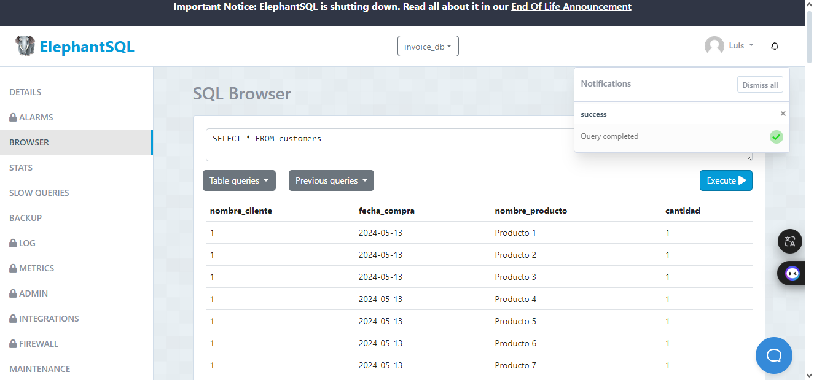
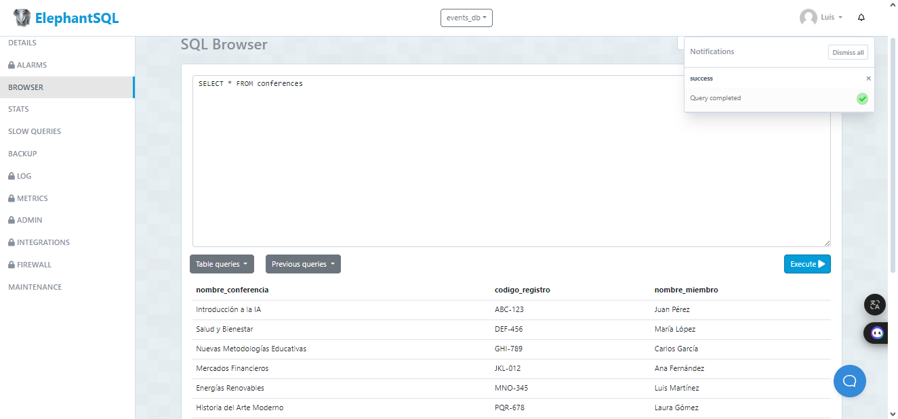

### Tarea TAS12 - views

1. **Crear una vista que muestre la lista de productos comprados por los clientes**
   ```sql
   CREATE VIEW customers As
   SELECT 
   i.client_id AS nombre_cliente,
   i.create_at As fecha_compra,
   p.description AS nombre_producto,
   1 AS cantidad
   FROM 
   invoice i 
   CROSS JOIN 
   product p;



1. **Crear una vista donde se muestre la lista de miembros registrados a las conferencias**
   ```sql
   CREATE VIEW conferences AS
   SELECT
   c.title AS nombre_conferencia,
   r.code AS codigo_registro,
   m.fullname AS nombre_miembro
   FROM 
   register r
   JOIN 
   conference c ON r.conference_id = c.id
   JOIN 
   member m ON r.member_id = m.id;



